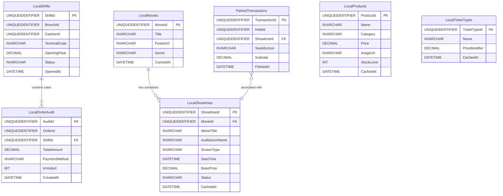

## 4. SQL Server Local Database Specification

The POS workstation maintains an embedded SQL Server (Express or LocalDB) database for high-availability offline caching, shift auditing, and cart parking.

### 4.1 Entity-Relationship Diagram (ERD)



---

### 4.2 SQL Table DDL & Schema Definitions

All table DDL schemas are declared in [`DatabaseInitializer.cs`]
#### 1. `LocalShifts`
Tracks active and historical terminal shifts for cash drawer balancing.
```sql
CREATE TABLE LocalShifts (
    ShiftId        UNIQUEIDENTIFIER PRIMARY KEY,
    BranchId       UNIQUEIDENTIFIER NOT NULL,
    CashierId      UNIQUEIDENTIFIER NOT NULL,
    TerminalCode   NVARCHAR(50)     NOT NULL,
    OpeningFloat   DECIMAL(18,2)    NOT NULL DEFAULT 0.00,
    Status         NVARCHAR(20)     NOT NULL DEFAULT 'open', -- 'open' | 'closed'
    OpenedAt       DATETIME         NOT NULL DEFAULT GETDATE()
);
```

#### 2. `ParkedTransactions`
Stores parked carts (Hold F9 / Resume F10) allowing cashiers to suspend transactions and serve other guests.
```sql
CREATE TABLE ParkedTransactions (
    TransactionId  UNIQUEIDENTIFIER PRIMARY KEY DEFAULT NEWID(),
    HoldId         UNIQUEIDENTIFIER NULL,
    ShowtimeId     UNIQUEIDENTIFIER NOT NULL,
    SeatIdsJson    NVARCHAR(MAX)    NOT NULL,               -- Serialized List<Guid>
    Subtotal       DECIMAL(18,2)    NOT NULL,
    ParkedAt       DATETIME         NOT NULL DEFAULT GETDATE()
);
```

#### 3. `LocalMovies`
Local cache of the movie catalogue to support catalog browsing during network blips.
```sql
CREATE TABLE LocalMovies (
    MovieId        UNIQUEIDENTIFIER PRIMARY KEY,
    Title          NVARCHAR(255)    NOT NULL,
    PosterUrl      NVARCHAR(500)    NULL,
    Genre          NVARCHAR(100)    NULL,
    CachedAt       DATETIME         NOT NULL DEFAULT GETDATE()
);
```

#### 4. `LocalShowtimes`
Cached showtime schedules joined to movies for offline seat selection.
```sql
CREATE TABLE LocalShowtimes (
    ShowtimeId     UNIQUEIDENTIFIER PRIMARY KEY,
    MovieId        UNIQUEIDENTIFIER NOT NULL,
    MovieTitle     NVARCHAR(255)    NOT NULL,
    AuditoriumName NVARCHAR(100)    NOT NULL,
    ScreenType     NVARCHAR(50)     NOT NULL,               -- 'STANDARD' | 'IMAX' | 'SCREENX' | 'ATMOS'
    StartTime      DATETIME         NOT NULL,
    BasePrice      DECIMAL(18,2)    NOT NULL,
    Status         NVARCHAR(20)     NOT NULL DEFAULT 'scheduled',
    CachedAt       DATETIME         NOT NULL DEFAULT GETDATE()
);
```

#### 5. `LocalProducts`
Local product and concessions catalog with inventory levels.
```sql
CREATE TABLE LocalProducts (
    ProductId      UNIQUEIDENTIFIER PRIMARY KEY,
    Name           NVARCHAR(255)    NOT NULL,
    Category       NVARCHAR(100)    NOT NULL,               -- 'Popcorn' | 'Beverages' | 'Combos' | 'Snacks'
    Price          DECIMAL(18,2)    NOT NULL,
    ImageUrl       NVARCHAR(500)    NULL,
    StockLevel     INT              NOT NULL DEFAULT 100,
    CachedAt       DATETIME         NOT NULL DEFAULT GETDATE()
);
```

#### 6. `LocalOrderAudit`
Local audit log recording all transactions, payment methods, and void events for shift reconciliation.
```sql
CREATE TABLE LocalOrderAudit (
    AuditId        UNIQUEIDENTIFIER PRIMARY KEY DEFAULT NEWID(),
    OrderId        UNIQUEIDENTIFIER NOT NULL,
    ShiftId        UNIQUEIDENTIFIER NOT NULL,
    TotalAmount    DECIMAL(18,2)    NOT NULL,
    PaymentMethod  NVARCHAR(50)     NOT NULL,               -- 'cash' | 'card' | 'qr'
    IsVoided       BIT              NOT NULL DEFAULT 0,
    CreatedAt      DATETIME         NOT NULL DEFAULT GETDATE()
);
```

#### 7. `LocalTicketTypes`
Cached demographic ticket price modifiers (Adult, Child, Senior, VIP).
```sql
CREATE TABLE LocalTicketTypes (
    TicketTypeId   UNIQUEIDENTIFIER PRIMARY KEY,
    Name           NVARCHAR(50)     NOT NULL,               -- 'Adult' | 'Child' | 'Senior' | 'VIP Upgrade'
    PriceModifier  DECIMAL(18,2)    NOT NULL DEFAULT 0.00,
    CachedAt       DATETIME         NOT NULL DEFAULT GETDATE()
);
```

---

