# Cinema POS — Complete System Flow Documentation

> **Last Updated**: 2026-09-28
> **Stack**: .NET 10 WinForms POS Client → YARP Gateway → ASP.NET Core Microservices → PostgreSQL / Redis / RabbitMQ

---

## Table of Contents

1. [Architecture Overview](#1-architecture-overview)
2. [Application Startup Flow](#2-application-startup-flow)
3. [Login & Session Flow](#3-login--session-flow)
4. [Main POS Terminal Flow](#4-main-pos-terminal-flow)
5. [Movie Browsing & Showtime Selection](#5-movie-browsing--showtime-selection)
6. [Seat Map & Seat Hold Flow](#6-seat-map--seat-hold-flow)
7. [F&B Concession Flow](#7-fb-concession-flow)
8. [Cart & Checkout Flow](#8-cart--checkout-flow)
9. [Payment Flow](#9-payment-flow)
10. [Ticket Issuance Flow](#10-ticket-issuance-flow)
11. [Booking / Reservation Lookup](#11-booking--reservation-lookup)
12. [Shift Management Flow](#12-shift-management-flow)
13. [Backend Microservices & API Endpoints](#13-backend-microservices--api-endpoints)
14. [PostgreSQL Database Schema](#14-postgresql-database-schema)
15. [SQL Server Local Storage (POS Client)](#15-sql-server-local-storage-pos-client)
16. [Model / DTO Classes](#16-model--dto-classes)
17. [Infrastructure Services](#17-infrastructure-services)
18. [Project File Structure](#18-project-file-structure)
19. [Phase Tracker & Roadmap](#19-phase-tracker--roadmap)

---

## 1. Architecture Overview

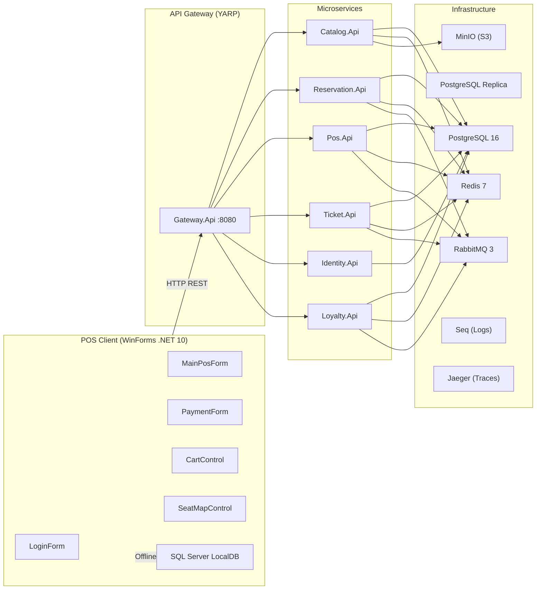

---

## 2. Application Startup Flow

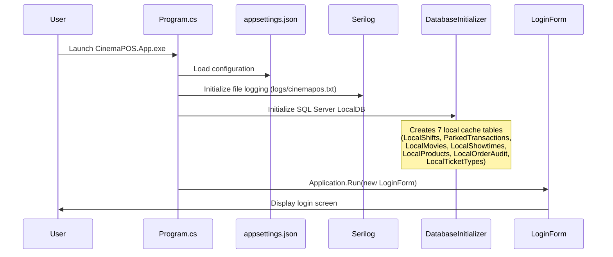

**Key Points:**
- Entry point: [`Program.cs`](CinemaPOS.App/Program.cs) with `[STAThread]`
- Reads `appsettings.json` for `ConnectionStrings:LocalDb`
- Initializes SQL Server LocalDB tables for offline caching
- Supports `--screenshot` modes for automated UI testing
- Serilog writes rolling daily logs to `logs/cinemapos.txt`

---

## 3. Login & Session Flow

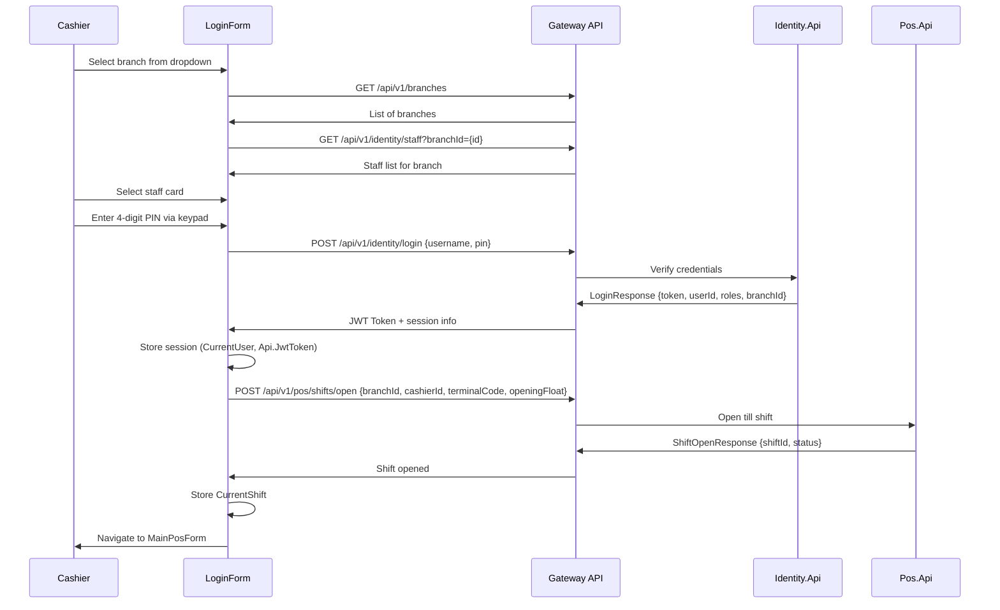

**Session State (static on `LoginForm`):**

| Property | Type | Description |
|----------|------|-------------|
| `CurrentUser` | `LoginResponse` | JWT token, userId, roles, branchId |
| `CurrentShift` | `ShiftOpenResponse` | Active shift ID, terminal code, opening float |
| `Api` | `ApiService` | Shared HTTP client with JWT bearer |
| `CurrentBranchName` | `string` | Display name of selected branch |

---

## 4. Main POS Terminal Flow

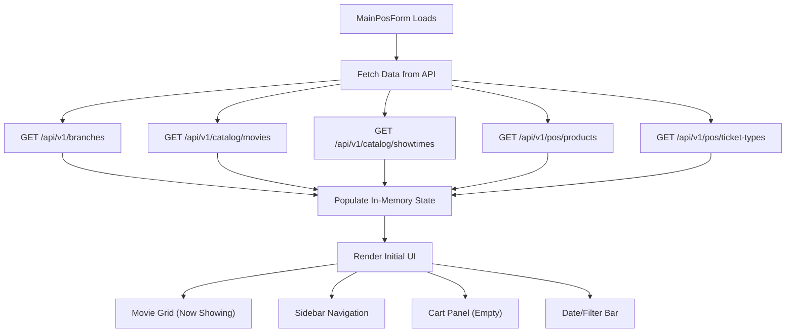

**Sidebar Navigation Views:**

| Nav Button | Key | View |
|-----------|-----|------|
| Movies | F10 | Movie poster grid with Now/Coming filters |
| Seat Map | F5 | Interactive seat selection for selected showtime |
| F&B Menu | F4 | Food & beverage product cards with images |
| Bookings | F2 | Reservation search & lookup |
| Terminal Settings | F8 | System config, shift close, logout |

**Keyboard Shortcuts:**

| Key | Action |
|-----|--------|
| F1 | Focus search bar |
| F2 | Switch to Bookings view |
| F3 | Open discount dialog |
| F4 | Switch to F&B view |
| F5 | Switch to Seat Map view |
| F8 | Open terminal settings |
| F9 | Sync seat holds |
| F10 | Switch to Movies view |
| F11 | Void current cart |
| F12 | Proceed to checkout / Pay |

---

## 5. Movie Browsing & Showtime Selection

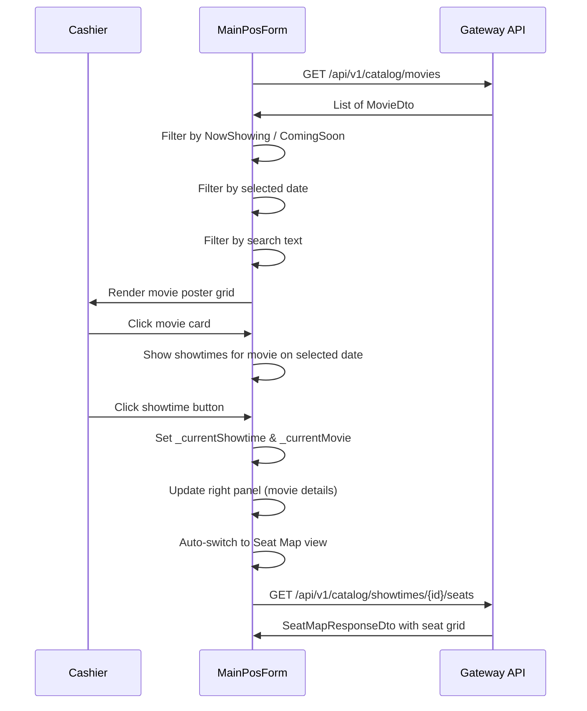

---

## 6. Seat Map & Seat Hold Flow

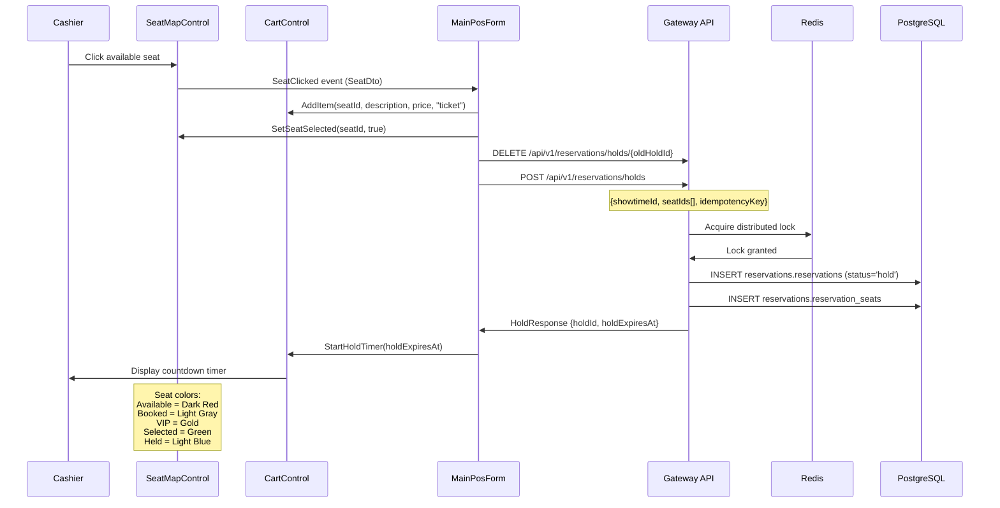

**Seat Types & Colors:**

| Status | Color | Hex |
|--------|-------|-----|
| Available | Dark Red | `#991B1B` |
| Booked | Light Gray | `#CBD5E1` |
| VIP | Gold | `#EAB308` |
| Selected | Green | `#16A34A` |
| Held | Light Blue | `#38BDF8` |
| Blocked | Slate Gray | `#64748B` |

**Concurrency Guard:**
- **Redis**: Advisory distributed lock for seat holds (expiring)
- **PostgreSQL**: `reservations.confirmed_seats` table with `PRIMARY KEY(showtime_id, seat_id)` provides the final ACID double-booking guard

---

## 7. F&B Concession Flow

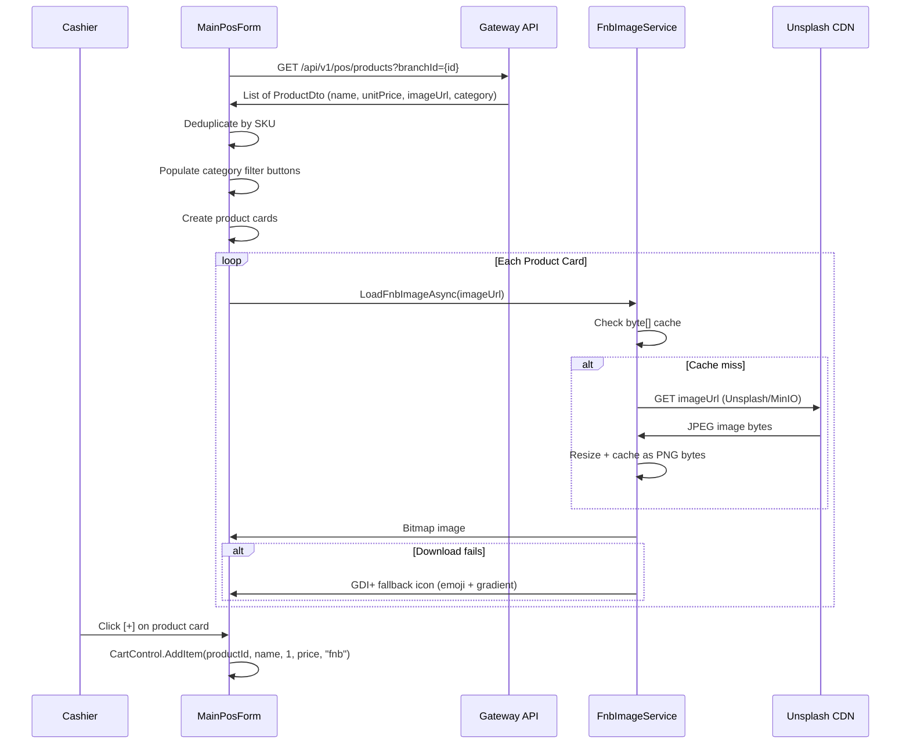

**F&B Categories:** Popcorn, Beverages, Snacks, Combos

**Image Loading Strategy:**
1. Fetch real image from API `imageUrl` (Unsplash or MinIO)
2. Cache downloaded images as `byte[]` (thread-safe, no GDI+ sharing)
3. If download fails → generate procedural GDI+ icon with category-specific emoji and gradient

---

## 8. Cart & Checkout Flow

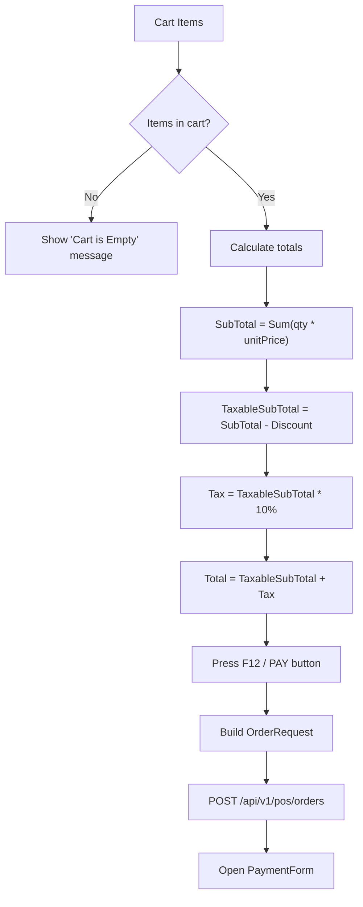

**Cart supports two item types:**
- `"ticket"` — Seat selections with showtime info
- `"fnb"` — Food & beverage products

**CartControl Properties:**

| Property | Type | Description |
|----------|------|-------------|
| `Items` | `IReadOnlyList<CartItem>` | All cart items |
| `SubTotal` | `decimal` | Sum of (qty * unitPrice) |
| `DiscountAmount` | `decimal` | Applied discount |
| `TaxRate` | `decimal` | 10% default VAT |
| `TaxAmount` | `decimal` | Calculated tax |
| `TotalAmount` | `decimal` | Final payable amount |

---

## 9. Payment Flow

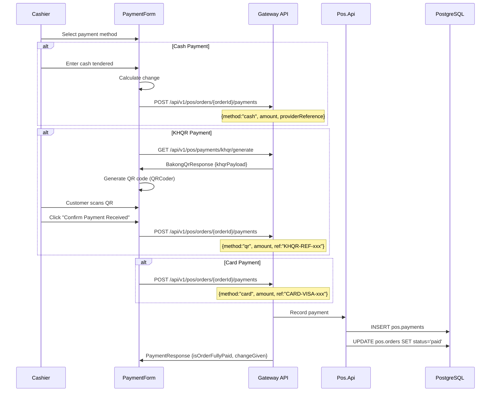

**Payment Methods:** Cash, Bakong KHQR (QR), Credit/Debit Card

---

## 10. Ticket Issuance Flow

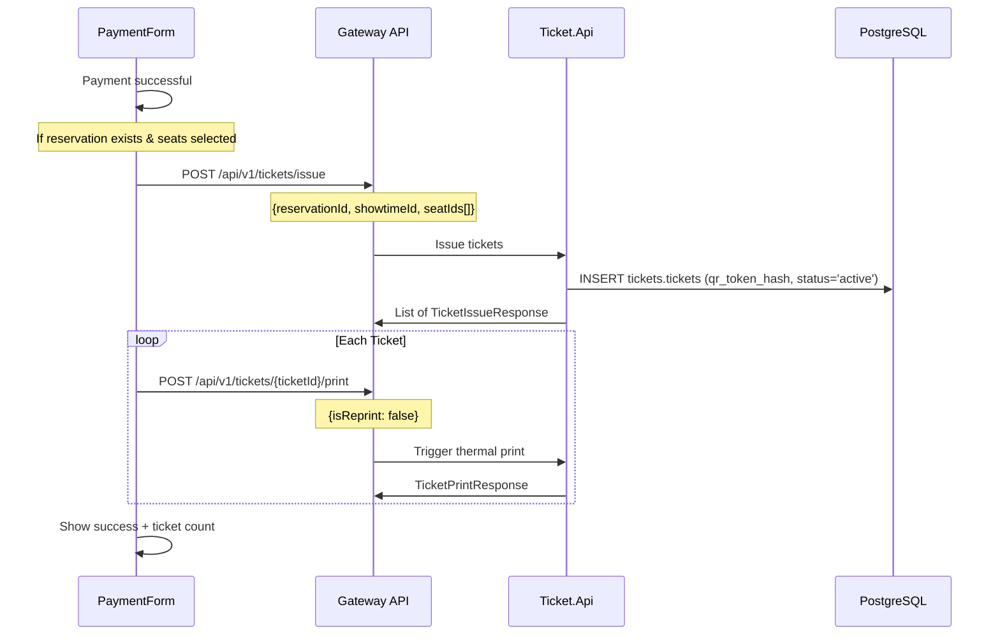

---

## 11. Booking / Reservation Lookup

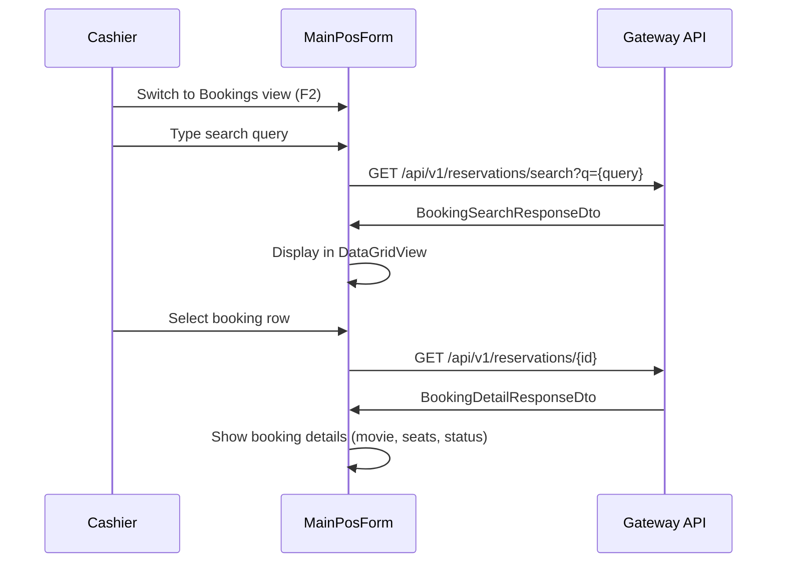

---

## 12. Shift Management Flow

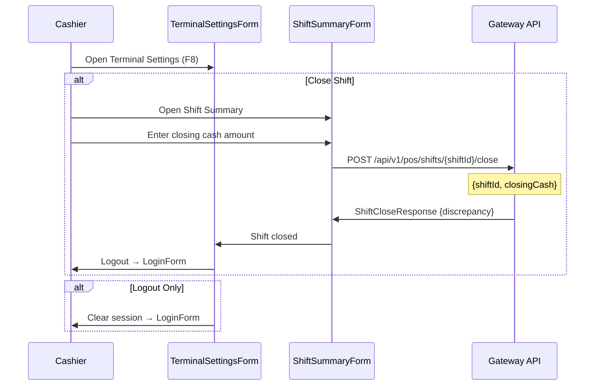

---

## 13. Backend Microservices & API Endpoints

### Service Map

| Service | Port | Responsibilities |
|---------|------|-----------------|
| **Gateway.Api** | 8080 | YARP reverse proxy, routes all `/api/v1/*` |
| **Identity.Api** | internal | Staff auth, PIN login, JWT, RBAC, JWKS |
| **Catalog.Api** | internal | Movies, showtimes, branches, auditoriums, media upload |
| **Reservation.Api** | internal | Seat holds, confirmations, booking search |
| **Pos.Api** | internal | Orders, payments, products, shifts, inventory |
| **Ticket.Api** | internal | Ticket issuance, QR codes, printing, redemption |
| **Loyalty.Api** | internal | Points, tiers, vouchers, member profiles |

### Key API Routes

**Identity.Api:**
- `POST /api/v1/identity/login` — Staff PIN login → JWT
- `GET /api/v1/identity/staff` — List staff by branch
- `POST /api/v1/identity/supervisor/verify` — Supervisor PIN check
- `GET /.well-known/jwks.json` — JWKS endpoint

**Catalog.Api:**
- `GET /api/v1/catalog/movies` — List movies (with status filter)
- `GET /api/v1/catalog/showtimes` — List showtimes (with date/branch filter)
- `GET /api/v1/catalog/showtimes/{id}/seats` — Seat map for showtime
- `GET /api/v1/branches` — List branches
- `GET /api/v1/media/files/{path}` — Serve media from MinIO

**Reservation.Api:**
- `POST /api/v1/reservations/holds` — Create seat hold (Redis lock + PG)
- `DELETE /api/v1/reservations/holds/{id}` — Release hold
- `POST /api/v1/reservations/{id}/confirm` — Confirm reservation
- `GET /api/v1/reservations/search` — Search bookings

**Pos.Api:**
- `GET /api/v1/pos/products` — List F&B products
- `POST /api/v1/pos/orders` — Create order
- `POST /api/v1/pos/orders/{id}/payments` — Record payment
- `POST /api/v1/pos/shifts/open` — Open cashier shift
- `POST /api/v1/pos/shifts/{id}/close` — Close shift
- `GET /api/v1/pos/ticket-types` — List ticket demographics

**Ticket.Api:**
- `POST /api/v1/tickets/issue` — Issue tickets for reservation
- `POST /api/v1/tickets/{id}/print` — Print ticket
- `POST /api/v1/tickets/redeem` — Redeem/scan ticket

**Loyalty.Api:**
- `GET /api/v1/loyalty/member/{id}` — Member profile
- `POST /api/v1/loyalty/points/earn` — Earn points
- `POST /api/v1/loyalty/vouchers/validate` — Validate voucher code

---

## 14. PostgreSQL Database Schema

### Schema Organization (Shared-Nothing)

| Schema | Owner Service | Purpose |
|--------|--------------|---------|
| `identity` | Identity.Api | Users, roles, staff shifts, audit |
| `catalog` | Catalog.Api | Branches, movies, showtimes, auditoriums, seats |
| `reservations` | Reservation.Api | Holds, confirmations, seat bookings |
| `pos` | Pos.Api | Products, orders, payments, shifts |
| `tickets` | Ticket.Api | Tickets, redemption audit |
| `public` | Shared | Audit log |

### Core Tables

#### `identity` Schema

```
identity.users
├── user_id (UUID PK)
├── branch_id (UUID FK → catalog.branches)
├── username (VARCHAR UNIQUE)
├── display_name (VARCHAR)
├── pin_hash (TEXT)
├── email, phone
├── is_active (BOOLEAN)
├── last_login_at (TIMESTAMPTZ)
└── created_at (TIMESTAMPTZ)

identity.roles
├── role_id (UUID PK)
└── name (VARCHAR UNIQUE) — cashier, supervisor, branch_manager, system_admin, etc.

identity.user_roles (user_id PK, role_id PK)

identity.staff_shifts
├── shift_id (UUID PK)
├── user_id (FK → users)
├── branch_id (FK → branches)
├── scheduled_start / scheduled_end
├── actual_start / actual_end
├── terminal_code, status, notes
└── created_at
```

#### `catalog` Schema

```
catalog.branches
├── branch_id (UUID PK)
├── code (VARCHAR UNIQUE) — e.g., "LEGEND-271"
├── name (VARCHAR) — e.g., "Legend 271 Mega Mall"
├── address, timezone
├── is_active (BOOLEAN)
└── created_at

catalog.movies
├── movie_id (UUID PK)
├── title, duration_minutes, genre, classification
├── poster_url (TEXT)
├── is_active (BOOLEAN)
└── created_at

catalog.auditoriums
├── auditorium_id (UUID PK)
├── branch_id (FK → branches)
├── name — e.g., "Hall 1 (SCREENX)"
├── capacity (INT CHECK > 0)
└── UNIQUE(branch_id, name)

catalog.seats
├── seat_id (UUID PK)
├── auditorium_id (FK → auditoriums)
├── row_label (VARCHAR) — e.g., "A", "B"
├── seat_number (INT CHECK > 0)
├── seat_type — standard, VIP, accessible
├── is_accessible, is_active
└── UNIQUE(auditorium_id, row_label, seat_number)

catalog.showtimes
├── showtime_id (UUID PK)
├── movie_id (FK → movies)
├── auditorium_id (FK → auditoriums)
├── starts_at, ends_at (CHECK ends_at > starts_at)
├── base_price (NUMERIC)
├── status — scheduled, cancelled, completed
└── UNIQUE(auditorium_id, starts_at)
```

#### `reservations` Schema

```
reservations.reservations
├── reservation_id (UUID PK)
├── showtime_id (UUID)
├── customer_id (UUID, nullable)
├── status (ENUM: hold, confirmed, cancelled, expired)
├── hold_expires_at (TIMESTAMPTZ)
├── idempotency_key (UUID UNIQUE)
├── fencing_token (BIGINT)
├── created_at, confirmed_at
└── CHECK: hold requires hold_expires_at

reservations.reservation_seats
├── reservation_id (PK, FK)
├── seat_id (PK)
└── price (NUMERIC)

reservations.confirmed_seats ← DOUBLE-BOOKING GUARD
├── showtime_id (PK)
├── seat_id (PK) ← Cannot book same seat twice for same showtime
├── reservation_id (FK)
└── booked_at
```

#### `pos` Schema

```
pos.products
├── product_id (UUID PK)
├── branch_id (FK → branches)
├── sku (VARCHAR) — e.g., "BEV-COK-L"
├── name, category, unit_price
├── image_url (TEXT)
├── is_active (BOOLEAN)
└── UNIQUE(branch_id, sku)

pos.orders
├── order_id (UUID PK)
├── branch_id (FK), cashier_id, reservation_id (UNIQUE)
├── status (ENUM: draft, pending_payment, paid, cancelled, refunded)
├── subtotal, discount_amount, total_amount
├── idempotency_key (UUID UNIQUE)
└── created_at, completed_at

pos.order_lines
├── order_line_id (UUID PK)
├── order_id (FK → orders)
├── product_id (FK, nullable), description
├── quantity, unit_price, line_total
└── Cascading delete with order

pos.payments
├── payment_id (UUID PK)
├── order_id (FK → orders)
├── method (ENUM: cash, card, qr, voucher, other)
├── amount, provider_reference, status
└── paid_at

pos.till_shifts
├── shift_id (UUID PK)
├── branch_id, cashier_id, terminal_code
├── opened_at, closed_at
├── opening_float, closing_cash
├── status (open / closed)
└── UNIQUE(branch_id, terminal_code, opened_at)
```

#### `tickets` Schema

```
tickets.tickets
├── ticket_id (UUID PK)
├── reservation_id, showtime_id, seat_id
├── qr_token_hash (CHAR(64) UNIQUE)
├── status (ENUM: active, void, used)
├── is_printed, printed_at, redeemed_at
├── created_at
└── UNIQUE(reservation_id, seat_id)

tickets.redemption_audit
├── audit_id (UUID PK)
├── ticket_id (FK), actor_id
├── action, terminal_code
├── occurred_at, metadata (JSONB)
```

### Custom PostgreSQL Types

| Type | Values |
|------|--------|
| `reservation_status` | hold, confirmed, cancelled, expired |
| `order_status` | draft, pending_payment, paid, cancelled, refunded |
| `payment_method` | cash, card, qr, voucher, other |
| `ticket_status` | active, void, used |

### Migration Files (ordered)

| Migration | Purpose |
|-----------|---------|
| `001-init.sql` | Core schema, all service tables, indexes, enums |
| `003-guest-checkout.sql` | Guest checkout support |
| `004-booking-numbers.sql` | Human-readable booking references |
| `005-fb-fulfillment.sql` | F&B order fulfillment tracking |
| `006-dynamic-pricing.sql` | Dynamic seat pricing rules |
| `007-combos.sql` | Combo meal products |
| `009-loyalty-schema.sql` | Loyalty tiers, points, vouchers |
| `012-outbox.sql` | Transactional outbox for events |
| `013-customer-accounts.sql` | Customer accounts & profiles |
| `014-order-voucher.sql` | Voucher redemption on orders |
| `015-rich-catalog-and-notifications.sql` | Extended movie metadata, notifications |
| `016-search-indexing-and-filters.sql` | Full-text search indexes |
| `017-screen-optimized-catalog.sql` | Screen format metadata |
| `018-customer-social-auth.sql` | OAuth/social login for customers |
| `019-enterprise-rbac-and-staff.sql` | Enterprise roles, staff shifts |
| `020-showtime-scheduling-and-seat-blocks.sql` | Showtime scheduling engine |
| `021-multi-branch-inventory-and-suppliers.sql` | Multi-branch stock management |
| `022-refunds-and-disputes.sql` | Refund/dispute handling |
| `023-system-feature-flags.sql` | Feature flag system |
| `024-fix-movies-supported-formats.sql` | Movie format corrections |

---

## 15. SQL Server Local Storage (POS Client)

The POS client uses **SQL Server LocalDB** as an offline cache. Tables are created by [`DatabaseInitializer.cs`](CinemaPOS.Core/Database/DatabaseInitializer.cs):

| Table | Purpose | Columns |
|-------|---------|---------|
| `LocalShifts` | Cache active shift | ShiftId, BranchId, CashierId, TerminalCode, OpeningFloat, Status, OpenedAt |
| `ParkedTransactions` | Hold incomplete orders | TransactionId, HoldId, ShowtimeId, SeatIdsJson, Subtotal, ParkedAt |
| `LocalMovies` | Cache movie catalog | MovieId, Title, PosterUrl, Genre, CachedAt |
| `LocalShowtimes` | Cache showtime data | ShowtimeId, MovieId, MovieTitle, AuditoriumName, ScreenType, StartTime, BasePrice, Status, CachedAt |
| `LocalProducts` | Cache F&B products | ProductId, Name, Category, Price, ImageUrl, StockLevel, CachedAt |
| `LocalOrderAudit` | Audit completed orders | AuditId, OrderId, ShiftId, TotalAmount, PaymentMethod, IsVoided, CreatedAt |
| `LocalTicketTypes` | Cache ticket demographics | TicketTypeId, Name, PriceModifier, CachedAt |

> [!NOTE]
> The local database provides **offline resilience** — if the API gateway is unreachable, the POS falls back to cached data and creates offline orders that can be synced later.

---

## 16. Model / DTO Classes

All models are in [`CinemaPOS.Core/Models/Dtos.cs`](CinemaPOS.Core/Models/Dtos.cs):

### Core DTOs

| Class | Properties | Used For |
|-------|-----------|----------|
| `BranchDto` | BranchId, Code, Name, Address, IsActive | Branch selection |
| `StaffUserDto` | UserId, Username, DisplayName, Role, BranchId | Staff list on login |
| `MovieDto` | MovieId, Title, Genre, Rating, DurationMinutes, PosterUrl, Status, Showtimes[] | Movie catalog |
| `ShowtimeDto` | ShowtimeId, MovieId, AuditoriumName, ScreenType, StartTime, BasePrice, Status | Showtime listing |
| `ProductDto` | ProductId, Name, Category, Price/UnitPrice, ImageUrl, Sku, Description, StockLevel | F&B products |
| `SeatDto` | SeatId, Row/RowLabel, SeatNumber, SeatType, Price, Status | Seat map rendering |
| `SeatMapResponseDto` | ShowtimeId, AuditoriumId, TotalSeats, AvailableSeats, Seats[] | Seat map container |
| `TicketTypeDto` | Id, Name, Label, PriceModifier | Adult/Child/Senior pricing |
| `CartItem` | Id, Description, Quantity, UnitPrice, Type ("ticket"/"fnb") | Cart state |

### Request/Response DTOs

| Class | Direction | Endpoint |
|-------|-----------|----------|
| `LoginRequest` / `LoginResponse` | POST | `/api/v1/identity/login` |
| `ShiftOpenRequest` / `ShiftOpenResponse` | POST | `/api/v1/pos/shifts/open` |
| `ShiftCloseRequest` / `ShiftCloseResponse` | POST | `/api/v1/pos/shifts/{id}/close` |
| `HoldRequest` / `HoldResponse` | POST | `/api/v1/reservations/holds` |
| `OrderRequest` / `OrderResponse` | POST | `/api/v1/pos/orders` |
| `OrderLineDto` | Nested in OrderRequest | Order line items |
| `PaymentRequest` / `PaymentResponse` | POST | `/api/v1/pos/orders/{id}/payments` |
| `TicketIssueRequest` / `TicketIssueResponse` | POST | `/api/v1/tickets/issue` |
| `TicketPrintRequest` / `TicketPrintResponse` | POST | `/api/v1/tickets/{id}/print` |
| `VoucherValidateRequest` / `VoucherValidateResponse` | POST | `/api/v1/loyalty/vouchers/validate` |
| `SupervisorVerifyRequest` / `SupervisorVerifyResponse` | POST | `/api/v1/identity/supervisor/verify` |
| `BakongQrResponse` | GET | `/api/v1/pos/payments/khqr/generate` |
| `MemberProfileDto` | GET | `/api/v1/loyalty/member/{id}` |

### Booking DTOs

| Class | Purpose |
|-------|---------|
| `BookingSearchResponseDto` | Paginated booking search results |
| `BookingSearchResultItemDto` | Individual booking summary |
| `BookingDetailResponseDto` | Full booking detail with movie, showtime, seats |
| `BookingDetailMovieDto` | Movie info within booking |
| `BookingDetailShowtimeDto` | Showtime info within booking |
| `BookingDetailSeatDto` | Seat detail within booking |

---

## 17. Infrastructure Services

### Docker Compose Services

| Service | Image | Port | Purpose |
|---------|-------|------|---------|
| `postgres` | postgres:16-alpine | 5433 | Primary write database |
| `postgres-replica` | postgres:16-alpine | 5434 | Read replica (streaming replication) |
| `redis` | redis:7-alpine | 6379 | Distributed locks, caching |
| `rabbitmq` | rabbitmq:3-management | 5672, 15672 | Integration events |
| `jaeger` | jaegertracing/all-in-one | 16686, 4317 | Distributed tracing (OpenTelemetry) |
| `seq` | datalust/seq | 5341 | Structured log aggregation |
| `minio` | minio | 9000, 9001 | S3-compatible object storage (posters, media) |
| `mailpit` | axllent/mailpit | 1025, 8025 | Dev email capture |
| `pgweb` | sosedoff/pgweb | 8086 | Database web UI |
| `redis-commander` | redis-commander | 8087 | Redis web UI |
| `db-migrator` | custom | — | Runs SQL migrations on startup |

### ApiService (HTTP Client)

[`ApiService.cs`](CinemaPOS.Core/Services/ApiService.cs) — centralized HTTP communication:

- **Base URL**: `http://localhost:8080` (Gateway)
- **Timeout**: 2 seconds
- **Retry Policy**: Polly — 1 retry with 300ms delay on 5xx errors
- **Auth**: Bearer JWT token from `LoginForm.CurrentUser.Token`
- **Headers**: Cache-Control: no-cache, X-Idempotency-Key, X-Supervisor-Pin
- **Envelope Unwrapping**: Auto-extracts from `{value: [...]}`, `{data: [...]}`, `{items: [...]}` wrappers

---

## 18. Project File Structure

```
POS client UI/
├── CinemaPOS.slnx                           # Solution file
│
├── CinemaPOS.Core/                          # Shared core library
│   ├── Models/
│   │   └── Dtos.cs                          # All DTO/model classes (585 lines)
│   ├── Services/
│   │   └── ApiService.cs                    # HTTP client with Polly retry
│   └── Database/
│       └── DatabaseInitializer.cs           # SQL Server LocalDB setup
│
├── CinemaPOS.App/                           # WinForms application
│   ├── Program.cs                           # Entry point + screenshot modes
│   ├── Forms/
│   │   ├── LoginForm.cs                     # Staff login, PIN keypad, session mgmt
│   │   ├── MainPosForm.cs                   # Main POS terminal (~3019 lines)
│   │   ├── PaymentForm.cs                   # Cash/KHQR/Card payment
│   │   ├── DiscountForm.cs                  # Discount/voucher application
│   │   ├── ShiftSummaryForm.cs              # Shift close & cash reconciliation
│   │   └── TerminalSettingsForm.cs          # Terminal config, logout
│   └── Controls/
│       ├── CartControl.cs                   # Shopping cart with timer
│       └── SeatMapControl.cs                # Interactive GDI+ seat grid
│
├── CinemaPOS.Tests/                         # xUnit test suite (63 tests)
│   ├── CartControlTests.cs                  # Cart add/remove/total tests
│   ├── CatalogAndSeatMapTests.cs            # Movie/seat/F&B integration tests
│   ├── DataContractAndRemediationTests.cs   # DTO serialization tests
│   ├── MainPosNavigationTests.cs            # Navigation & keyboard shortcut tests
│   └── TerminalSettingsTests.cs             # Settings form tests
```

---

## 19. Phase Tracker & Roadmap

### Phase 1 — Core POS Foundation ✅ COMPLETE

| Feature | Status |
|---------|--------|
| PostgreSQL canonical schema (all service tables) | ✅ |
| Docker Compose with all services | ✅ |
| YARP API Gateway routing | ✅ |
| Identity.Api — Staff login with PIN, JWT, RBAC | ✅ |
| Catalog.Api — Movies, showtimes, branches, seats | ✅ |
| Reservation.Api — Seat holds with Redis + PG guard | ✅ |
| Pos.Api — Orders, payments, products, shifts | ✅ |
| Ticket.Api — Ticket issuance, QR, printing | ✅ |
| Loyalty.Api — Points, vouchers, member profiles | ✅ |
| Database migrations (001 through 024) | ✅ |
| Seed data (branches, staff, products, movies) | ✅ |

### Phase 2 — POS Client UI ✅ COMPLETE

| Feature | Status |
|---------|--------|
| LoginForm — Branch selection, staff cards, PIN keypad | ✅ |
| MainPosForm — Full POS terminal layout | ✅ |
| Movie browsing — Now Showing / Coming Soon, date filter, search | ✅ |
| Showtime selection — Time slots per movie/date | ✅ |
| Seat Map — Interactive GDI+ with color-coded statuses | ✅ |
| Seat Hold — Redis advisory + PG ACID guard | ✅ |
| F&B Menu — Product cards with real API images, category filter | ✅ |
| Cart — Ticket + F&B items, discount, 10% tax, hold timer | ✅ |
| Payment — Cash (with change), KHQR QR, Credit Card | ✅ |
| Ticket issuance — Auto-issue + print after payment | ✅ |
| Booking search — Reservation lookup by reference | ✅ |
| Shift management — Open/close shift, cash reconciliation | ✅ |
| Terminal settings — Config, logout, shift close | ✅ |
| Sidebar navigation — Movies, Seat Map, F&B, Bookings | ✅ |
| Keyboard shortcuts — F1-F12 POS operations | ✅ |
| SQL Server LocalDB — Offline caching | ✅ |
| ApiService — Polly retry, JWT auth, envelope unwrapping | ✅ |
| UI polish — Logo, colors, seat colors, row labels | ✅ |
| F&B real images from API (Unsplash CDN) | ✅ |
| Test suite — 63 passing tests | ✅ |

### Phase 3 — Remaining / Future Work 🔲 NOT STARTED

| Feature | Status | Notes |
|---------|--------|-------|
| Online/offline sync engine | 🔲 | Sync LocalDB parked orders to backend when reconnected |
| Receipt/thermal printer integration | 🔲 | ESC/POS commands to physical printer |
| Barcode scanner input handling | 🔲 | Concessions barcode scan workflow |
| Customer loyalty lookup at POS | 🔲 | Scan member card, apply tier discounts |
| Refund/void flow (end-to-end) | 🔲 | Supervisor-authorized refund with API |
| Multi-payment split | 🔲 | Pay part cash, part card on same order |
| Dynamic pricing integration | 🔲 | Weekend/holiday/VIP surcharge rules |
| Real-time seat availability (WebSocket) | 🔲 | Live push updates for held/booked seats |
| Admin UI integration | 🔲 | Bridge Admin UI inventory changes to POS |
| End-to-end integration tests (Testcontainers) | 🔲 | Full Docker-based integration tests |
| Production deployment pipeline | 🔲 | CI/CD, staging, monitoring |
| Bakong KHQR webhook verification | 🔲 | Server-side payment confirmation |

> [!IMPORTANT]
> **You are currently at: Phase 2 COMPLETE.** All core POS client features are built and tested. Phase 3 contains enhancement and production-readiness features.

---

## End-to-End Transaction Summary

```mermaid
flowchart LR
    A["1. Login"] --> B["2. Select Movie"]
    B --> C["3. Pick Showtime"]
    C --> D["4. Select Seats"]
    D --> E["5. Seats Held (Redis + PG)"]
    E --> F["6. Add F&B (optional)"]
    F --> G["7. Review Cart"]
    G --> H["8. Apply Discount (optional)"]
    H --> I["9. Create Order (POST)"]
    I --> J["10. Pay (Cash/QR/Card)"]
    J --> K["11. Issue Tickets"]
    K --> L["12. Print Tickets"]
    L --> M["13. Transaction Complete"]
    M --> N["14. Ready for Next Customer"]
```
