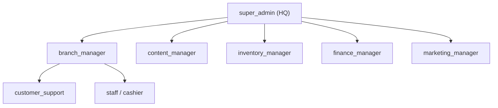
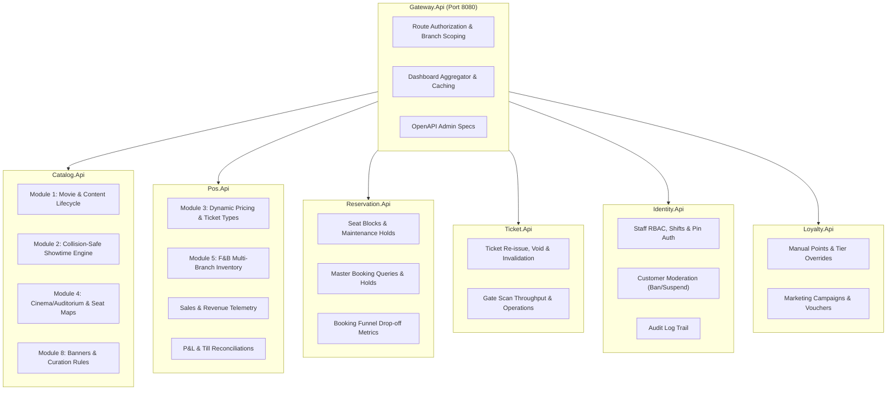

# Enterprise Cinema POS — Back-Office, Admin & Executive Dashboard Architecture Plan

## Executive Summary & System Vision
In an enterprise multi-branch cinema ecosystem, administrative and management operations span far beyond simple CRUD tables. Different corporate stakeholders—ranging from HQ executives and studio programmers to branch managers, floor supervisors, inventory stock controllers, and customer support staff—require purpose-built workflows, rigorous guardrails against operational errors (such as double-booked halls, scheduling collisions, or untracked refunds), and role-tailored analytical dashboards.

This plan establishes the comprehensive architecture for the Cinema POS Admin & Back-Office platform, partitioning responsibilities across the microservices domain boundary:
1. **8 Hierarchical RBAC Roles** with branch-scoping and fine-grained authorization policies.
2. **9 Dedicated Back-Office Domain Modules** covering everything from movie lifecycle and collision-safe scheduling to multi-branch inventory, booking dispute resolution, and campaign marketing.
3. **11 Role-Tailored Real-Time Dashboards** providing operational telemetry, financial P&L, occupancy heatmaps, and fraud detection.
4. **Structured Phased Delivery Plan** allowing incremental, zero-downtime rollout adhering strictly to `AGENTS.md`.

---

## 1. Role Hierarchy & Policy-Based Authorization Matrix

### 1.1 The 8 Canonical Roles
| Role Name | Scope | Key Responsibilities & Capabilities |
| :--- | :--- | :--- |
| `super_admin` | Global (HQ) | Full system control across all branches; tenant/branch provisioning; feature flags; security & audit access; global role management. |
| `branch_manager` | Single Branch | Operational oversight of assigned branch; till audits, shift reconciliations, daily schedule execution, local staff management, override approvals. |
| `content_manager` | Global / Regional | Movie catalog curation, regional age ratings, format availability, price cards, collision-safe showtime builder, bulk scheduling. |
| `inventory_manager`| Global / Branch | Concession catalog, multi-branch stock levels, supplier management, purchase orders, spoilage/wastage write-offs, real-time POS out-of-stock toggling. |
| `finance_manager` | Global | Revenue recognition, daily cash/card settlements, distributor box-office share calculation, refund authorizations, dispute reviews. |
| `marketing_manager`| Global | Promotional campaigns, loyalty tier management, promo codes, bundle deals, homepage banners/curation, push/email broadcasts. |
| `customer_support` | Global | Cross-branch booking lookup, ticket re-issuance/emailing, manual cancellations, seat relocation, customer account assistance. |
| `staff` (`cashier`) | Single Branch | On-premise POS ticket and concession sales, till shift opening/closing, gate ticket scanning and verification. |

### 1.2 Policy Hierarchy & Security Enforcement
Policies will be registered in `Cinema.Foundation` using ASP.NET Core authorization policies and evaluated at both the API Gateway (`Gateway.Api`) and the individual microservices:



#### Authorization Invariant: Branch Scoping
- If a user has `super_admin`, `content_manager`, `finance_manager`, `marketing_manager`, or `customer_support`, they can query and operate across all branches or filter by any `branch_id`.
- If a user has `branch_manager` or `staff`, the system strictly validates that `X-Branch-Id` or route/query `branch_id` matches the user's assigned `branch_id` claim extracted from the validated JWT token. Cross-branch access returns `403 Forbidden`.

---

## 2. Microservice Domain Mapping & Architectural Alignment

To preserve bounded contexts and avoid monolithic coupling, the 9 modules and 11 dashboards are distributed across our existing services:



---

## 3. The 9 Dedicated Back-Office Domain Modules

### Module 1: Movie & Content Management (`Catalog.Api`)
*Empowers Content Managers to manage the cinematic catalog lifecycle with regional ratings and format configurations.*
- **Capabilities:**
  - Full CRUD on Movie metadata (Title, Duration, Synopsis, Cast, Director, Trailer, Posters, Backdrops).
  - Release status state machine: `coming_soon` ➔ `now_showing` ➔ `ended`. Transitions trigger Redis catalog cache invalidations.
  - Format compatibility mapping: Link movies to supported formats (e.g. 2D, 3D, IMAX, 4DX, ScreenX).
  - Regional censorship/age ratings: `G`, `PG`, `PG-13`, `NC-15`, `R-18` with localized viewer advisory text.
- **Endpoints:**
  - `POST /api/v1/admin/movies` (ContentManager, SuperAdmin)
  - `PUT /api/v1/admin/movies/{movieId}` (ContentManager, SuperAdmin)
  - `PATCH /api/v1/admin/movies/{movieId}/status` (ContentManager, SuperAdmin)
  - `DELETE /api/v1/admin/movies/{movieId}` (SuperAdmin only, soft-deactivates if showtimes exist)
  - `GET /api/v1/admin/movies` (Rich search, filter by release status, format, censor rating)

---

### Module 2: Showtime & Scheduling Engine (`Catalog.Api` & `Reservation.Api`)
*Guarantees zero scheduling collisions, enforces mandatory cleaning/turnaround buffers, and supports bulk schedule import.*
- **Capabilities & Business Invariants:**
  1. **Collision Guard:** When scheduling a showtime in an auditorium, calculate `runtime = movie.duration_minutes + cleaning_buffer_minutes (default: 15 mins)`.
  2. **Overlap Query:** Ensure `[starts_at, starts_at + runtime]` does not overlap with any existing non-cancelled showtime in the same auditorium using PostgreSQL temporal check:
     ```sql
     SELECT 1 FROM catalog.showtimes 
     WHERE auditorium_id = @AuditoriumId 
       AND status != 'cancelled'
       AND tstzrange(starts_at, ends_at, '[)') && tstzrange(@NewStart, @NewEnd, '[)')
     LIMIT 1;
     ```
  3. **Bulk Schedule Import:** Accept CSV/Excel upload with batch validation:
     - Returns row-level status (`valid`, `conflict`, `invalid_movie`, `invalid_auditorium`).
     - Supports dry-run validation and atomic batch commit.
  4. **Seat Blocks & Maintenance Holds:** Admin can block specific seats (e.g., VIP holds, sponsor rows, wheelchair companions, broken recliner repair) for an auditorium or specific showtime without creating a monetary reservation.
- **Endpoints:**
  - `POST /api/v1/admin/showtimes` (ContentManager, BranchManager, SuperAdmin)
  - `PUT /api/v1/admin/showtimes/{showtimeId}`
  - `DELETE /api/v1/admin/showtimes/{showtimeId}` (Checks for confirmed bookings; warns or requires cancellation reason)
  - `POST /api/v1/admin/showtimes/bulk-import` (CSV multipart, dry-run or execute)
  - `POST /api/v1/admin/showtimes/{showtimeId}/seat-holds` (Block/unblock seats for maintenance or VIPs)

---

### Module 3: Pricing, Ticket Types & Promotions (`Catalog.Api` & `Pos.Api`)
*Enables dynamic pricing models, format surcharges, and discount promotions.*
- **Capabilities:**
  - Ticket Type Cards: Adult, Child (under 12), Senior (60+), Student, VIP/Couple.
  - Price Matrices: Seat Type (Standard, VIP, Recliner) × Ticket Type × Price.
  - Surcharges: 3D glasses surcharge, IMAX Laser premium surcharge, weekend/peak hour surge multipliers.
  - Dynamic Pricing Rules: Day-of-week discounts (e.g., "Cinema Wednesday"), Matinee show discounts (before 12:00 PM).
- **Endpoints:**
  - `GET /api/v1/admin/pricing/price-cards`
  - `POST /api/v1/admin/pricing/price-cards`
  - `PUT /api/v1/admin/pricing/price-cards/{id}`
  - `POST /api/v1/admin/pricing/rules` (Configures dynamic surge/matinee rules)
  - `GET /api/v1/admin/pricing/ticket-types`

---

### Module 4: Cinema/Branch & Seat Layout Management (`Catalog.Api`)
*Interactive seat map designer, branch profile management, and hall maintenance modes.*
- **Capabilities:**
  - Multi-branch administration: Add/edit cinema branches, timezone, location, opening hours, facilities (parking, Dolby, lounge).
  - Auditorium configuration: Screen format association (IMAX, 4DX, Standard), total capacity, projector/sound specs.
  - Visual Seat Map Builder: Define rows, seats, aisles, seat types (`standard`, `vip`, `couple`, `recliner`, `accessible`, `companion`), and out-of-order/broken seats.
  - Screen Maintenance Mode: Take an entire auditorium offline for maintenance; prevents new showtime creation and alerts if scheduled shows exist.
- **Endpoints:**
  - `POST /api/v1/admin/branches` (SuperAdmin)
  - `PUT /api/v1/admin/branches/{branchId}`
  - `POST /api/v1/admin/branches/{branchId}/auditoriums`
  - `PUT /api/v1/admin/auditoriums/{auditoriumId}/seat-map` (JSON seat layout payload)
  - `POST /api/v1/admin/auditoriums/{auditoriumId}/maintenance` (Toggle maintenance status)

---

### Module 5: F&B & Inventory Management (`Pos.Api`)
*Multi-branch stock tracking, supplier management, spoilage logging, and real-time POS out-of-stock toggles.*
- **Capabilities:**
  - Product Catalog: Categories (Popcorn, Beverages, Combos, Hot Food, Merch), sizes (Regular, Large, Jumbo), dietary tags.
  - Multi-Branch Stock Tracking: Table `pos.branch_inventory` tracking `stock_quantity`, `reorder_threshold`, `is_out_of_stock`.
  - Reorder Alerts: Highlights items falling below their reorder threshold.
  - Spoilage / Wastage Logging: Log damaged, expired, or dropped items with staff ID and loss reason.
  - Real-Time POS Sync: Toggling an item out-of-stock immediately pushes an event / cache update so cashier tills and customer apps show "Sold Out".
- **Endpoints:**
  - `GET /api/v1/admin/inventory/branches/{branchId}/stock`
  - `POST /api/v1/admin/inventory/branches/{branchId}/stock/adjust` (Restock, physical count reconciliation)
  - `POST /api/v1/admin/inventory/branches/{branchId}/stock/wastage` (Record spoilage/loss)
  - `PATCH /api/v1/admin/inventory/products/{productId}/branches/{branchId}/availability` (Instant out-of-stock toggle)
  - `GET /api/v1/admin/inventory/reorder-alerts`

---

### Module 6: Booking & Transaction Management (`Reservation.Api`, `Pos.Api`, `Ticket.Api`)
*Cross-branch search, customer service resolution, refunds, ticket reissuing, and fraud dispute handling.*
- **Capabilities:**
  - Master Booking Search: Query across all branches by Customer Email, Phone Number, Booking Reference (`BKG-...`), or Transaction ID.
  - Manual Refund & Cancellation:
    - Refund whole order or specific ticket/concession items.
    - Reverses confirmed seat records in `reservations.confirmed_seats`.
    - Marks tickets as `void` in `tickets.tickets`.
    - Records refund reason code (`customer_request`, `cancelled_showtime`, `technical_issue`, `chargeback`) and auditing staff ID.
  - Ticket Re-Issuance: Resend e-tickets with QR codes via email/SMS (Mailpit integration), or regenerate QR token if compromised.
- **Endpoints:**
  - `GET /api/v1/admin/bookings/search?query=...&branchId=...&date=...`
  - `GET /api/v1/admin/bookings/{reservationId}`
  - `POST /api/v1/admin/bookings/{reservationId}/refund`
  - `POST /api/v1/admin/bookings/{reservationId}/reissue-ticket`
  - `POST /api/v1/admin/bookings/{reservationId}/flag-dispute`

---

### Module 7: User & Loyalty Management (`Identity.Api` & `Loyalty.Api`)
*Customer account moderation, points/tier overrides, and staff RBAC administration.*
- **Capabilities:**
  - Customer Moderation: Search customers, view booking history and loyalty tier, suspend/ban fraudulent accounts.
  - Loyalty Adjustments: Manual points credits/debits with mandatory reason notes, tier override (e.g. comping VIP Gold tier to an executive).
  - Staff Management: Create staff accounts, set 4-digit PIN / password, assign branch and roles (`cashier`, `supervisor`, `branch_manager`, `content_manager`, `inventory_manager`, `finance_manager`, `marketing_manager`).
  - Shift Scheduling: Create till shift schedules and assign staff terminals.
- **Endpoints:**
  - `GET /api/v1/admin/customers`
  - `PATCH /api/v1/admin/customers/{customerId}/status` (Active, Suspended, Banned)
  - `POST /api/v1/admin/loyalty/customers/{customerId}/adjust-points`
  - `PUT /api/v1/admin/loyalty/customers/{customerId}/override-tier`
  - `GET /api/v1/admin/staff`
  - `POST /api/v1/admin/staff`
  - `PUT /api/v1/admin/staff/{userId}`

---

### Module 8: Marketing & CRM (`Loyalty.Api` & `Catalog.Api`)
*Customer segmentation, broadcast campaigns, carousel curation, and A/B test promotions.*
- **Capabilities:**
  - Customer Segmentation: Group customers by frequency (Active, Lapsed > 60 days), high-spenders (VIP Gold/Platinum), or genre affinity (Sci-Fi fans).
  - Campaign Broadcasts: Trigger email/push notifications (via Mailpit) with promo codes or showtime announcements.
  - Curation Rules: Set banner display priority and tags for mobile/web apps (`GET /api/v1/catalog/movies/featured`).
  - Promo Vouchers: Generate batch single-use or multi-use discount codes with usage limits and expiration dates.
- **Endpoints:**
  - `GET /api/v1/admin/marketing/segments`
  - `POST /api/v1/admin/marketing/broadcasts`
  - `GET /api/v1/admin/marketing/promotions`
  - `POST /api/v1/admin/marketing/promotions`
  - `POST /api/v1/admin/marketing/vouchers/generate-batch`

---

### Module 9: System & Technical Admin (`Gateway.Api` & Foundation)
*Technical governance, integration health, feature flags, and tamper-proof audit trails.*
- **Capabilities:**
  - Feature Flags: Toggle capabilities dynamically (e.g., `enable_google_login`, `enable_dynamic_surge`, `enable_kiosk_mode`, `maintenance_banner`).
  - Audit Trail: Query `public.audit_log` with filters for `actor_id`, `service_name`, `action`, and date range.
  - Integration Monitor: Live connectivity checks and latency metrics for PostgreSQL, Redis, RabbitMQ, MinIO S3, and Payment Gateways.
- **Endpoints:**
  - `GET /api/v1/admin/system/feature-flags`
  - `PUT /api/v1/admin/system/feature-flags/{key}`
  - `GET /api/v1/admin/system/audit-logs`
  - `GET /api/v1/admin/system/integrations/health`

---

## 4. The 11 Role-Tailored Real-Time Dashboards

Each dashboard aggregates metrics tailored to specific organizational personas. All endpoints are cached in Redis (with 30s to 5m TTL) to ensure ultra-fast response times under heavy executive traffic.

```mermaid
classDiagram
    class ExecutiveDashboard {
        +decimal TotalGrossRevenue
        +decimal BoxOfficeRevenue
        +decimal FnBRevenue
        +int TotalTicketsSold
        +double OverallOccupancyRate
        +List~BranchPerformance~ Branches
        +List~TopMovie~ TopMovies
    }
    class SalesRevenueDashboard {
        +decimal HourlyGross
        +decimal DailyGross
        +Dictionary~string, decimal~ PaymentMethodShare
        +decimal AverageOrderValue
        +decimal AverageTicketYield
    }
    class OccupancyDashboard {
        +double SeatUtilizationPercentage
        +double RevenuePerAvailableSeat
        +List~AuditoriumUtilization~ ScreenBreakdown
        +List~ShowtimeMetric~ PeakVsDeadSlots
    }
    class InventoryDashboard {
        +List~ProductStockAlert~ LowStockAlerts
        +decimal WastageTotalCost
        +List~TopSellingItem~ FastMovingItems
        +decimal InventoryTurnoverRatio
    }
    class ProfitLossDashboard {
        +decimal GrossBoxOffice
        +decimal DistributorFilmHireCut
        +decimal NetBoxOffice
        +decimal GrossConcessions
        +decimal CostOfGoodsSold
        +decimal NetOperatingIncome
    }
    class CustomerCRMDashboard {
        +int TotalRegisteredCustomers
        +int ActiveMembers30Days
        +Dictionary~string, int~ TierDistribution
        +int TotalUnredeemedPointsLiability
    }
    class MarketingDashboard {
        +int CampaignsActive
        +decimal PromoCodeDiscountsGiven
        +decimal AttributedRevenue
        +double CampaignConversionRate
    }
    class FunnelDashboard {
        +int ShowtimePageViews
        +int SeatSelectionHolds
        +int CheckoutInitiated
        +int OrdersPaid
        +double FunnelConversionRate
        +double AbandonmentDropOffRate
    }
    class OperationsDashboard {
        +int TodayTotalShowtimes
        +int CompletedShowtimes
        +int GateScansCount
        +int OpenTillShiftsCount
        +List~AuditoriumStatus~ CurrentScreenStatus
    }
    class SystemHealthDashboard {
        +string DatabaseStatus
        +double DbQueryP99Latency
        +string RedisStatus
        +long RedisMemoryUsedBytes
        +string RabbitMqStatus
        +int QueueMessageBacklog
        +string StorageStatus
    }
    class FraudRiskDashboard {
        +int HighVolumeRefundCount
        +decimal TotalRefundAmount
        +int FailedPaymentSpikes
        +List~SuspiciousAccount~ FlaggedAccounts
    }
```



### Dashboard Endpoint Catalog
1. **Executive / HQ Overview:** `GET /api/v1/admin/dashboards/executive?fromDate=...&toDate=...`
2. **Sales & Revenue:** `GET /api/v1/admin/dashboards/sales?branchId=...&granularity=hourly|daily|monthly`
3. **Occupancy & Screen Performance:** `GET /api/v1/admin/dashboards/occupancy?branchId=...&movieId=...`
4. **F&B & Inventory Telemetry:** `GET /api/v1/admin/dashboards/inventory?branchId=...`
5. **Profit & Loss (Finance):** `GET /api/v1/admin/dashboards/finance-pnl?fromDate=...&toDate=...`
6. **Customer / CRM Analytics:** `GET /api/v1/admin/dashboards/crm-loyalty`
7. **Marketing & Promotions:** `GET /api/v1/admin/dashboards/marketing?campaignId=...`
8. **Booking Funnel & Conversion:** `GET /api/v1/admin/dashboards/funnel?fromDate=...&toDate=...`
9. **Branch Operations (Today's Live Ops):** `GET /api/v1/admin/dashboards/operations?branchId=...`
10. **System Health & Telemetry:** `GET /api/v1/admin/dashboards/system-health`
11. **Fraud & Risk Metrics:** `GET /api/v1/admin/dashboards/fraud-risk?fromDate=...&toDate=...`

---

## 5. Database Schema Migrations Strategy

We will introduce forward-only, idempotent SQL migrations in `infra/postgres/migrations/`:

### Migration 019: `019-enterprise-rbac-and-staff.sql`
- Expand `identity.roles`: insert `super_admin`, `content_manager`, `inventory_manager`, `finance_manager`, `marketing_manager`, `customer_support`.
- Add `email`, `phone`, `last_login_at` to `identity.users`.
- Table `identity.staff_shifts`: scheduled shifts, start/end time, branch assignment.
- Table `identity.user_audit`: tracks role grants, suspensions, and password changes.

### Migration 020: `020-showtime-scheduling-and-seat-blocks.sql`
- Add `cleaning_buffer_minutes INT NOT NULL DEFAULT 15` to `catalog.auditoriums`.
- Add GiST / btree range index on `catalog.showtimes` for overlap prevention:
  ```sql
  CREATE EXTENSION IF NOT EXISTS btree_gist;
  -- Prevents overlapping active showtimes in the same auditorium
  ALTER TABLE catalog.showtimes 
  ADD CONSTRAINT no_overlapping_showtimes 
  EXCLUDE USING gist (
      auditorium_id WITH =,
      tstzrange(starts_at, ends_at, '[)') WITH &&
  ) WHERE (status != 'cancelled');
  ```
- Table `catalog.seat_blocks`:
  - `block_id UUID PRIMARY KEY`, `auditorium_id UUID`, `showtime_id UUID NULL`, `seat_id UUID`, `reason VARCHAR(50)`, `blocked_by UUID`, `created_at TIMESTAMPTZ`.

### Migration 021: `021-multi-branch-inventory-and-suppliers.sql`
- Table `pos.branch_inventory`:
  - `inventory_id UUID PRIMARY KEY`, `branch_id UUID REFERENCES catalog.branches`, `product_id UUID REFERENCES pos.products`, `stock_quantity INT NOT NULL DEFAULT 0`, `reorder_threshold INT NOT NULL DEFAULT 20`, `is_out_of_stock BOOLEAN NOT NULL DEFAULT false`, `last_restocked_at TIMESTAMPTZ`, `updated_at TIMESTAMPTZ`, UNIQUE(`branch_id`, `product_id`).
- Table `pos.inventory_wastage`:
  - `wastage_id UUID PRIMARY KEY`, `branch_id UUID`, `product_id UUID`, `quantity INT`, `reason VARCHAR(100)`, `cost_loss NUMERIC(12,2)`, `logged_by UUID`, `logged_at TIMESTAMPTZ`.
- Table `pos.suppliers` & `pos.purchase_orders`.

### Migration 022: `022-refunds-and-disputes.sql`
- Table `pos.refunds`:
  - `refund_id UUID PRIMARY KEY`, `order_id UUID REFERENCES pos.orders`, `reservation_id UUID`, `refund_amount NUMERIC(12,2) NOT NULL`, `reason_code VARCHAR(50) NOT NULL`, `notes TEXT`, `authorized_by UUID NOT NULL`, `refunded_at TIMESTAMPTZ NOT NULL DEFAULT now()`.
- Table `pos.disputes`:
  - `dispute_id UUID PRIMARY KEY`, `order_id UUID`, `provider_dispute_id VARCHAR(100)`, `status VARCHAR(30)`, `amount NUMERIC(12,2)`, `evidence_notes TEXT`, `created_at TIMESTAMPTZ`.

### Migration 023: `023-system-feature-flags.sql`
- Table `public.system_feature_flags`:
  - `key VARCHAR(100) PRIMARY KEY`, `description TEXT`, `is_enabled BOOLEAN NOT NULL DEFAULT false`, `environment VARCHAR(30) NOT NULL DEFAULT 'all'`, `updated_by UUID`, `updated_at TIMESTAMPTZ`.

---

## 6. Implementation Roadmap & Structured Milestones

To maintain stability and ensure tests pass at every step, the work will be divided into the following sequential milestones:

```mermaid
gantt
    title Enterprise Admin Implementation Milestones
    dateFormat  YYYY-MM-DD
    section Identity & Foundation
    Milestone 5.1: RBAC Hierarchy & Staff Operations        :m1, 2026-09-17, 2d
    section Catalog & Scheduling
    Milestone 5.2: Movie, Screen & Collision-Safe Scheduler :m2, after m1, 3d
    section Pricing & Inventory
    Milestone 5.3: Price Cards, Surcharges & Multi-Stock    :m3, after m2, 3d
    section Support & Disputes
    Milestone 5.4: Master Booking, Refunds & Reissue       :m4, after m3, 2d
    section Marketing & System
    Milestone 5.5: Marketing CRM, Campaigns & Feature Flags :m5, after m4, 2d
    section Executive BI
    Milestone 5.6: The 11 Role-Tailored BI Dashboards       :m6, after m5, 3d
```

### Milestone 5.1: RBAC Hierarchy & Staff Operations
- **Scope:** Migration `019-enterprise-rbac-and-staff.sql`.
- **Services:** `Identity.Api`, `Cinema.Foundation`, `Gateway.Api`.
- **Tasks:**
  - Register new roles (`super_admin`, `content_manager`, `inventory_manager`, `finance_manager`, `marketing_manager`, `customer_support`, `staff`).
  - Add authorization policies in `Cinema.Foundation/ServiceDefaults.cs`.
  - Staff CRUD endpoints in `Identity.Api` with branch scoping.
  - Unit tests for permission validation and branch tenant isolation.

### Milestone 5.2: Movie, Screen & Collision-Safe Scheduling Engine
- **Scope:** Migration `020-showtime-scheduling-and-seat-blocks.sql`.
- **Services:** `Catalog.Api`, `Reservation.Api`.
- **Tasks:**
  - Admin Movie CRUD with status transitions (`coming_soon` ➔ `now_showing` ➔ `ended`).
  - Screen Format & Auditorium layout configuration.
  - Collision-safe showtime scheduling engine with buffer enforcement.
  - CSV bulk schedule importer with dry-run validation.
  - Seat blocks/holds table and API.
  - Unit and integration tests for schedule collision and buffer checks.

### Milestone 5.3: Ticket Pricing Cards, Surcharges & F&B Multi-Branch Inventory
- **Scope:** Migration `021-multi-branch-inventory-and-suppliers.sql`.
- **Services:** `Catalog.Api`, `Pos.Api`.
- **Tasks:**
  - Ticket type price matrices (Adult, Child, Senior, VIP) and 3D/IMAX surcharges.
  - Multi-branch stock tracking (`pos.branch_inventory`), reorder thresholds, and fast out-of-stock toggles.
  - Spoilage / wastage write-off logging.
  - Unit tests for stock depletion and out-of-stock POS sync.

### Milestone 5.4: Customer Support, Booking Dispute & Transaction Operations
- **Scope:** Migration `022-refunds-and-disputes.sql`.
- **Services:** `Reservation.Api`, `Pos.Api`, `Ticket.Api`.
- **Tasks:**
  - Master booking search endpoint (`GET /api/v1/admin/bookings/search`).
  - Atomic refund workflow: releases confirmed seats, marks ticket void, logs refund record.
  - Ticket re-issuance (resend email via Mailpit, regenerate QR token).
  - Unit tests verifying atomic rollback if refund fails mid-transaction.

### Milestone 5.5: Marketing CRM, Campaigns & Technical System Admin
- **Scope:** Migration `023-system-feature-flags.sql`.
- **Services:** `Identity.Api`, `Loyalty.Api`, `Catalog.Api`, `Gateway.Api`.
- **Tasks:**
  - Customer moderation (ban, suspend, view history).
  - Loyalty points manual adjustment & tier overrides with audit logs.
  - Marketing campaign broadcast & voucher generation.
  - System feature flags & tamper-proof audit log viewer.

### Milestone 5.6: The 11 Role-Tailored Real-Time BI Dashboards
- **Scope:** Aggregation queries and telemetry endpoints across services with Redis caching.
- **Services:** `Gateway.Api`, `Pos.Api`, `Catalog.Api`, `Reservation.Api`.
- **Tasks:**
  - Implement all 11 dashboard endpoints (`/api/v1/admin/dashboards/...`).
  - Configure Redis caching with tag-based invalidation.
  - Add unit tests for KPI formula calculations (gross yield, occupancy %, conversion rate).

---

## 7. Verification & Handoff Criteria (Adhering to `AGENTS.md`)

Before any milestone is completed or handed off:
1. **Database Idempotency:** SQL migrations run cleanly on fresh or existing databases without data loss.
2. **Security Checks:** All admin endpoints must be authenticated and enforce role/branch checks; zero secrets exposed.
3. **Data Integrity:** All state-changing operations require idempotency keys and transactional rollback guards.
4. **Mandatory Handoff Test Run:**
   ```powershell
   dotnet build CinemaPos.sln -c Release
   dotnet test tests/Cinema.UnitTests/Cinema.UnitTests.csproj -c Release --no-build
   dotnet test tests/Cinema.IntegrationTests/Cinema.IntegrationTests.csproj -c Release --no-build
   docker compose config
   ```
5. **Documentation:** OpenAPI specs updated and documented for every admin endpoint.
