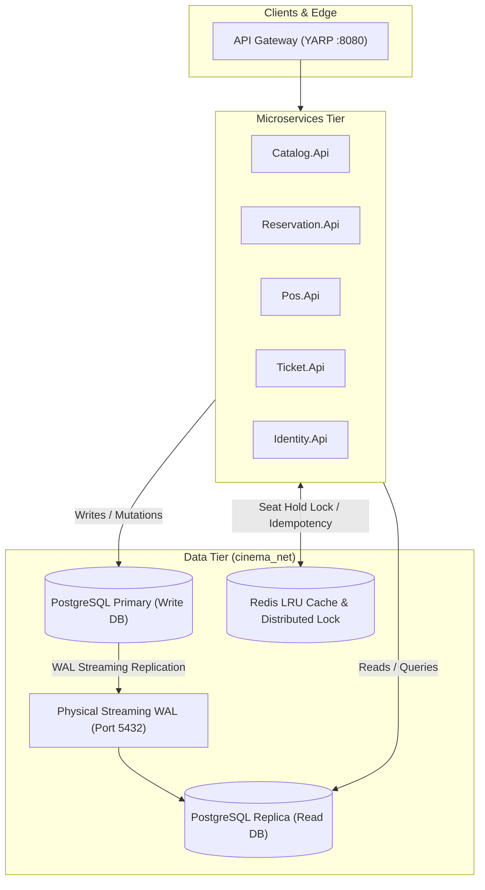

# PostgreSQL Master-Replica Streaming Replication & CQRS Architecture

**Project:** CinemaPos Multi-Branch Cinema POS & Ticketing System  
**Component:** Database Tier Resilience & Scalability  

---

## 1. Master-Replica Streaming Architecture

The Cinema POS system employs a **CQRS (Command Query Responsibility Segregation)** database architecture:
- **Primary (Write DB):** Handles all mutating state transactions (`INSERT`, `UPDATE`, `DELETE`) with strict ACID guarantees (Serializable / Read Committed isolation levels).
- **Replica (Read DB):** Offloads high-volume query traffic (Catalog browsing, showtime lookups, seat availability polling).



---

## 2. Production WAL Streaming Configuration

In production environments, replication is established using PostgreSQL physical streaming:

### Primary (`postgresql.conf`):
```ini
wal_level = replica
max_wal_senders = 10
max_replication_slots = 10
hot_standby = on
archive_mode = on
archive_command = 'test ! -f /var/lib/postgresql/archive/%f && cp %p /var/lib/postgresql/archive/%f'
```

### Primary (`pg_hba.conf`):
```ini
host replication replicator 10.0.0.0/16 scram-sha-256
```

### Replica Provisioning (`pg_basebackup`):
```bash
pg_basebackup -h postgres-primary -D /var/lib/postgresql/data -U replicator -v -P -R -X stream
```
*The `-R` flag automatically creates `standby.signal` and configures `primary_conninfo` in `postgresql.auto.conf`.*

---

## 3. Why Master-Replica + Redis Caching is Sufficient (No Sharding Needed)

1. **Transaction Throughput:**
   - A multi-branch cinema chain processing 10,000 tickets/minute generates ~170 writes/second. Modern PostgreSQL instances comfortably handle 10,000+ writes/second on single primary instances without sharding.
2. **Operational Complexity:**
   - Sharding introduces distributed two-phase commits (2PC), cross-shard joins, and significant operational risk. 
3. **Read Scalability:**
   - 95% of traffic is read-heavy (movie showtimes, seat maps). This is scaled horizontally via Read Replicas and cached in Redis with jittered TTLs (540s–660s).
4. **ACID Atomicity:**
   - Single-primary ordering guarantees zero distributed transaction anomalies when confirming seat reservations and issuing tickets.
